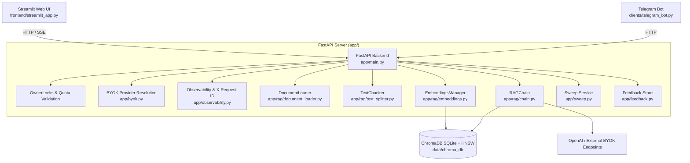

# 🤖 RAG Architecture & System Blueprint

This document is the authoritative architectural reference for the **Multi-language RAG Document Assistant**. It details component responsibilities, data flows, core technical decisions, and strict invariants that must be preserved when modifying or extending this codebase.

---

## 1. High-Level Architecture

The system enables users to upload heterogeneous documents (PDF, DOCX, Markdown, TXT) and ask questions in multiple languages with source attribution and follow-up conversational capabilities.



---

## 2. Directory Layout & Module Responsibilities

```
Multi-language-RAG-Document-Assistant/
├── app/                      # FastAPI backend application
│   ├── config.py             # Single source of truth Settings (pydantic-settings)
│   ├── main.py               # FastAPI app factory, routes, lifespan, OwnerLocks
│   ├── byok.py               # Bring-Your-Own-Key provider table & ephemeral client
│   ├── storage.py            # Disk file paths, sizes, atomic removal & wipe
│   ├── activity.py           # Touch markers for tracking idle namespaces
│   ├── sweep.py              # Idle-namespace garbage collection logic
│   ├── backup.py             # Backup archive creation and metadata manifest
│   ├── feedback.py           # Append-only feedback store with byte-budget cap
│   ├── humanize.py           # Byte and quota formatting helpers
│   ├── observability.py      # X-Request-ID middleware, logging filter, /ready check
│   ├── models/
│   │   └── schemas.py        # Pydantic request/response models
│   └── rag/
│       ├── chain.py          # RAGChain, Condensation, MMR, CitationStripper
│       ├── embeddings.py     # EmbeddingsManager (ChromaDB + distance conversions)
│       ├── document_loader.py# PDF, DOCX (with tables), MD, TXT (charset detection)
│       ├── text_splitter.py  # TextChunker (RecursiveCharacterTextSplitter)
│       └── languages.py      # Canonical language definitions & prompt rules
├── clients/                  # Client applications & shared utilities
│   ├── backend.py            # Shared client helpers, URLs, error formatting, quotas
│   └── telegram_bot.py       # Telegram bot (python-telegram-bot) with chunk splitting
├── frontend/
│   └── streamlit_app.py      # Streamlit web UI with SSE streaming & BYOK panel
├── evaluation/               # Deterministic RAG evaluation suite
│   ├── golden.py             # Labelled golden evaluation corpus & cases
│   ├── metrics.py            # Recall@k, Precision@k, MRR, Hit@k
│   ├── run_eval.py           # Live backend benchmark script
│   └── from_feedback.py      # Convert negative user ratings to golden case stubs
├── scripts/                  # CLI maintenance tools
│   ├── backup.py             # Offline backup tool
│   ├── restore.py            # Restore archive tool
│   └── sweep.py              # CLI runner for idle namespace sweep
├── tests/                    # 900+ unit & integration tests (100% offline)
├── Dockerfile                # Multi-stage build (builder with toolchain, slim runtime)
├── docker-compose.yml        # Production Compose shape
├── docker-compose.override.yml # Development Compose shape (reload, bind mounts)
└── DOCUMENTATION.md          # Exhaustive human documentation
```

---

## 3. Strict Architectural Invariants & Decisions

When maintaining or extending this codebase, **always adhere to these principles**:

### 3.1. Synchronous `def` vs. `async def` Handlers
- In `app/main.py`, handlers for `/upload`, `/query`, `/query/stream`, `/clear`, `/documents`, `/feedback`, and `/ready` are declared with **`def`**, NOT `async def`.
- **Rationale**: File extraction (PyPDF, docx), ChromaDB SQLite reads/writes, and OpenAI SDK client calls are blocking synchronous operations. If declared `async def`, they would execute on the main asyncio event loop, causing any slow upload or search to block all incoming traffic (including health checks). FastAPI automatically offloads synchronous `def` routes to an internal threadpool.

### 3.2. Single-Writer ChromaDB & Persistence Protection
- ChromaDB uses SQLite + HNSW index files on disk. SQLite can corrupt or get out of step if accessed concurrently across processes.
- The FastAPI application is the **only live process** permitted to write to ChromaDB.
- `scripts/backup.py` and `scripts/restore.py` check `/ready` and **refuse to run** while the backend is alive (unless explicitly bypassed with `--live`).
- Collections record the embedding model name in metadata (`MODEL_METADATA_KEY = "embedding_model"`). Attempting to open an existing collection with a different embedding model raises a `ValueError` immediately to prevent vector dimension mismatch.

### 3.3. Tenant Separation & Security Model
- Multi-tenancy is enforced via `user_id` (regex: `^[A-Za-z0-9_-]{1,64}$`).
- Every query to ChromaDB **must** use `EmbeddingsManager._owned(owner, ...)`, which builds a `{"$and": [{"user_id": {"$eq": owner}}, ...]}` clause.
- Files on disk are stored strictly in `data/uploads/<user_id>/<hash>_<filename>`.
- Shared lock manager `OwnerLocks` provides a striped mutex (64 stripes) using SHA-256 on `user_id` to prevent memory bloat while serializing simultaneous uploads from the same tenant.

### 3.4. Ephemeral "Bring Your Own Key" (BYOK)
- Callers may provide headers `X-Model-Key`, `X-Model`, and `X-Model-Provider`.
- Key validation: Must be ASCII, 8-256 characters (`^[A-Za-z0-9._\-]{8,256}$`).
- Provider endpoints: Selected strictly from the server-controlled `PROVIDERS` dict (`openai`, `anthropic`, `gemini`, `deepseek`, `kimi`, `kimi-cn`). Arbitrary base URLs are rejected to prevent SSRF.
- Lifecycle: The key is held in memory only for the duration of the request. The client is closed in a `finally` block (`byok.close_quietly(client)`). No key is ever saved to disk, database, or logs.
- Indexing/embedding always stays on the operator's key because vector space dimension is fixed per collection.

### 3.5. Content Deduplication & Revision Retirement
- Content hash: 16 hex characters (`sha256(contents).hexdigest()[:16]`).
- Re-uploading identical bytes for the same owner is a no-op (`UploadResponse(duplicate=True, chunks=0)`).
- Re-uploading a file under an existing filename with *new* content automatically supersedes the old revision: the new revision is indexed first; once safe, earlier revisions are retired and their files unlinked.

### 3.6. Clean Citation Streaming
- Prompt instructs the LLM not to emit citations like `[1]`, `[2]`.
- As a defense-in-depth safeguard against streaming token fragmentation (e.g. `[` followed by `1]`), `CitationStripper` maintains a small internal lookahead buffer so raw markdown citations never reach the frontend.
- Sources are delivered separately as structured metadata (`{"type": "sources", "sources": [...]}`).

### 3.7. Observability & Tracing
- `RequestContextMiddleware` generates or propagates `X-Request-ID` (16 hex chars).
- `RequestIdFilter` injects `request_id` into all log records (`LOG_FORMAT`).
- Endpoints:
  - `GET /health`: Liveness probe (process up). Does not check storage.
  - `GET /ready`: Readiness probe (tests ChromaDB ping). Polled by Compose healthcheck.

---

## 4. RAG Pipeline Deep Dive

### 4.1. Document Loading (`app/rag/document_loader.py`)
- **PDF**: `PyPDFLoader` loading page by page with metadata (`page`, `total_pages`).
- **DOCX**: Extracts both `document.paragraphs` and all `document.tables`. Rows are formatted as `cell1 | cell2`. Merged cells are deduplicated.
- **TXT / Markdown**: Reads raw bytes, attempts UTF-8 with BOM stripping (`utf-8-sig`), and falls back to `charset_normalizer.from_bytes()` for legacy Cyrillic (`cp1251`, `koi8-r`) and Latin encodings. Markdown syntax is deliberately preserved to retain heading and list hierarchies for the LLM.

### 4.2. Chunking & Embeddings (`app/rag/text_splitter.py`, `app/rag/embeddings.py`)
- `TextChunker`: Wraps `RecursiveCharacterTextSplitter` with chunk size 1000 and overlap 200.
- `OpenAIEmbeddingFunction`: Batches texts (batch size 100) and logs total billed tokens.
- Distance to Similarity conversion:
  $$\text{cosine similarity} = 1.0 - \frac{d_{l2}}{2.0}$$
  Ensures thresholds are intuitive floats between $0.0$ and $1.0$.

### 4.3. Retrieval & MMR (`app/rag/chain.py`)
- **Conversational Condensation**: If `history` is present, `_condense()` rewrites ambiguous queries (e.g., "how much does it cost?") into standalone queries using the chat model before vector search.
- **Relevance Filtering**: Drops any retrieved chunk whose cosine similarity is below `RELEVANCE_THRESHOLD`.
- **Maximal Marginal Relevance (MMR)**: When `mmr_lambda < 1.0`, retrieves candidates ($k \times 4$) with stored vectors from ChromaDB in a single round trip, then iteratively selects diverse vectors trading relevance against redundancy.

### 4.4. Streaming Architecture
- Route: `POST /query/stream` -> Server-Sent Events (`text/event-stream`).
- Events structure:
  - `data: {"type": "sources", "sources": [...]}` (sent first)
  - `data: {"type": "token", "text": "..."}` (streamed tokens)
  - `data: {"type": "done"}`
- Generator is primed before sending headers so upstream authorization/quota failures return clean HTTP status codes instead of broken SSE streams.
