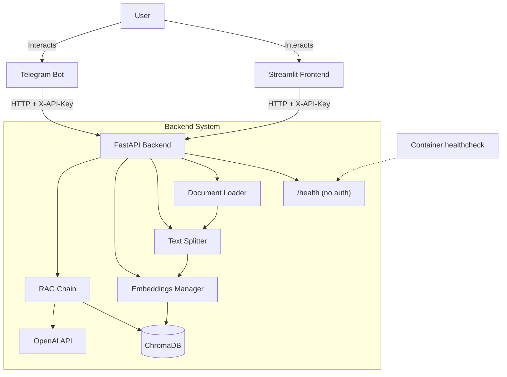

# 📄 Multi-language RAG Document Assistant - Technical Documentation

A RAG (Retrieval-Augmented Generation) assistant that lets users query their own documents
(PDF, TXT) in multiple languages with source attribution.

## Key Features

- **Multi-document Support**: specialized loaders for PDF and TXT files, with charset
  detection for legacy text encodings.
- **Intelligent Chunking**: overlapping chunks preserve context - 1000 characters with 200 characters of overlap by default, configurable via `CHUNK_SIZE` / `CHUNK_OVERLAP`.
- **Multilingual Support**: explicit prompt rules for English, Russian, Kazakh, French,
  German, Spanish, Chinese, and Japanese, plus an `Auto` mode that mirrors the question.
- **RAG Architecture**: ChromaDB for vector storage, OpenAI for embeddings and generation.
- **Source Attribution**: answers ship with a separate list of source filenames and
  200-character previews. Inline citation markers are stripped from the answer text.
- **Modern UI**: Streamlit, responsive for desktop and mobile.
- **API**: FastAPI backend, guarded by a shared-secret header.
- **Telegram Bot**: full bot integration for mobile access.
- **Tenant Separation**: a `user_id` on every chunk keeps document sets apart. See
  [Tenant separation and the trust model](#tenant-separation-and-the-trust-model) for
  what this does and does not guarantee.

## System Architecture



### Components

1.  **Frontend (`frontend/`)**:
    -   Built with Streamlit.
    -   Handles file uploads and the question/answer interface.
    -   Communicates with the backend over REST.

2.  **Telegram Bot (`telegram/`)**:
    -   Built with `python-telegram-bot`.
    -   Supports document uploads (PDF/TXT) and text queries.
    -   Keeps the chosen answer language in per-user state.

3.  **Backend (`app/`)**:
    -   **API (`main.py`)**: exposes `/upload`, `/query`, `/clear`, and `/health`.
        `create_app()` is an application factory; components are built once during
        `lifespan` startup and stored on `app.state`.
    -   **Configuration (`config.py`)**: a single pydantic-settings `Settings` class is the
        one source of truth. Components receive values from it rather than reading the
        environment themselves.
    -   **Document Loader (`rag/document_loader.py`)**: parses files and extracts metadata.
    -   **Text Splitter (`rag/text_splitter.py`)**: recursive semantic chunking.
    -   **Embeddings Manager (`rag/embeddings.py`)**: OpenAI embeddings plus ChromaDB
        persistence, over a `chromadb.PersistentClient`.
    -   **RAG Chain (`rag/chain.py`)**: retrieval and generation with language rules.

## Installation & Setup

### Prerequisites

- Python 3.10 - the version used by the Docker image, CI, and the ruff target.
- An OpenAI API key.
- A Telegram bot token (only if you run the bot).

### Steps (Manual)

1.  **Clone the repository**
    ```bash
    git clone <repository-url>
    cd Multi-language-RAG-Document-Assistant
    ```

2.  **Create and activate a virtual environment**
    ```bash
    python -m venv .venv
    source .venv/bin/activate  # On Windows: .venv\Scripts\activate
    ```

3.  **Install dependencies**
    ```bash
    pip install -r requirements.txt
    ```

4.  **Configure the environment**

    Copy `.env.template` to `.env` and fill it in:
    ```env
    OPENAI_API_KEY=sk-...
    # Shared secret every client sends as X-API-Key. Use a long random ASCII
    # string. Empty disables authentication (development only).
    BACKEND_API_KEY=<long-random-string>
    TELEGRAM_BOT_TOKEN=...        # only needed for the bot
    MODEL_NAME=gpt-4o-mini
    TEMPERATURE=0
    ```
    `OPENAI_API_KEY` has no default: without it the process aborts at startup with a
    pydantic `ValidationError`.

### Run locally

```bash
uvicorn app.main:app --reload --port 8000      # backend
streamlit run frontend/streamlit_app.py        # web UI
python telegram/bot.py                         # bot
```

### Development

```bash
pip install -r requirements-dev.txt
ruff check app frontend telegram tests
pytest -q
```

### Dependencies and the lock files

`requirements.txt` and `requirements-dev.txt` are the **input specs** - they pin
the direct dependencies only. `requirements.lock` and `requirements-dev.lock` are
the **fully resolved** sets: every transitive package pinned, with SHA-256 hashes.

Why both: pinning only the 17 direct dependencies left ~130 transitive ones
floating, and that is exactly how an incompatible `posthog` release started
logging an error on every startup. The Docker image and CI install from the
locks, so a build is reproducible and `pip` refuses any artifact whose hash does
not match.

The locks are resolved **for linux / CPython 3.10** - the image and CI. On a
Windows or macOS development machine, install from `requirements.txt` instead;
the hashes in the lock refer to Linux wheels.

To change a dependency: edit the input spec, then regenerate **both** locks and
commit them together.

```bash
pip install uv==0.12.5

uv pip compile requirements.txt \
  --python-platform linux --python-version 3.10 \
  --generate-hashes --no-strip-extras \
  --output-file requirements.lock

uv pip compile requirements.txt requirements-dev.txt \
  --python-platform linux --python-version 3.10 \
  --generate-hashes --no-strip-extras \
  --output-file requirements-dev.lock
```

Compiling *into* the existing files is deliberate: uv reads them as version
preferences, so a new upstream release does not silently move an unrelated pin.
Forgetting to regenerate is caught twice - by `tests/test_lockfile.py` locally
and by the `lock` job in CI, which recompiles and fails on any diff.

`--no-strip-extras` is not optional. uv strips extras by default, which records
`uvicorn==0.29.0` instead of `uvicorn[standard]==0.29.0`. chromadb then asks pip
for `uvicorn[standard]`, pip treats the extra-decorated name as a separate
unpinned requirement, and `--require-hashes` refuses the whole file. The Docker
build is what caught this; no local check could.

The suite is **offline by construction**: an autouse fixture replaces OpenAI embedding
calls with deterministic local vectors, and `RAGChain` takes an injected client, so no test
reaches the network. `OPENAI_API_KEY` must still be set to any non-empty value.
`pyproject.toml` sets `testpaths = ["tests"]`, so a bare `pytest` collects only that
directory.

## Docker Deployment

`docker compose` automatically merges `docker-compose.override.yml` on top of
`docker-compose.yml`, so the two modes are:

```bash
# Development - bind-mounts the working tree, runs the API with --reload
docker compose up --build

# Production - code baked into the image, detached, no override
docker compose -f docker-compose.yml up -d --build
```

This starts:
- **Backend API**: `http://127.0.0.1:8000` - published on the **loopback interface only**
  (`127.0.0.1:8000:8000`). Other hosts reach it only through the frontend/bot on the
  internal `rag_net` network, or through a reverse proxy you add yourself.
- **Streamlit Frontend**: `http://localhost:8501` - published on all interfaces.
- **Telegram Bot**: connects to Telegram over outbound polling.

The frontend and bot wait for the backend's `depends_on: service_healthy` gate, which is
driven by the `/health` probe. Both receive `BACKEND_URL=http://backend:8000` from the
`environment:` block, which takes precedence over any `BACKEND_URL` in `.env`; every other
variable arrives via `env_file: .env`.

The `bot` service requires a valid `TELEGRAM_BOT_TOKEN` - without one the container exits
and restarts continuously. To run without it: `docker compose up backend frontend`.

Uploads and the vector database live in the named volumes `data_uploads` and `data_chroma`,
so they survive `docker compose down` (use `down -v` to discard them).

## Usage

### 1. Backend API
Interactive docs at `http://localhost:8000/docs`. Every endpoint except `GET /health`
requires the `X-API-Key` header.

### 2. Streamlit Web Interface
Open `http://localhost:8501`. Upload in the sidebar, ask in the main pane.

### 3. Telegram Bot
1. Send `/start` and pick an answer language.
2. Attach a document (PDF/TXT).
3. Send any plain text message to ask a question.
4. `/clear` removes your documents; `/help` shows usage.

## API Reference

**Authentication.** Every endpoint below except `GET /health` requires the header
`X-API-Key: <BACKEND_API_KEY>` and answers `401` otherwise. If `BACKEND_API_KEY` is empty
the check is skipped entirely - development only, and a warning is logged at startup.

`user_id` is **required** everywhere and must match `^[A-Za-z0-9_-]{1,64}$`; anything else
is rejected with `422`. It doubles as a directory name and a metadata filter value, which
is why it is restricted.

### `GET /health`
Liveness probe. **No authentication.**
-   **Response**: `{"status": "ok", "version": "0.2.0"}`
-   Used by the Compose healthcheck and by `depends_on: service_healthy`.

### `POST /upload`
Uploads and indexes a document.
-   **Body**: `multipart/form-data` with `file` (`.txt` or `.pdf`).
-   **Query Parameters**: `user_id` (**required**, see above).
-   **Response (indexed)**:
    ```json
    {"message": "Document processed successfully", "filename": "report.pdf",
     "chunks": 15, "duplicate": false}
    ```
-   **Response (duplicate)** - the same bytes were already indexed for this `user_id`
    (deduplicated by SHA-256 of the file content):
    ```json
    {"message": "Document already indexed (identical content)", "filename": "report.pdf",
     "chunks": 0, "duplicate": true}
    ```
-   **Errors**:
    -   `400` - unsupported extension, empty file, no extractable text, a corrupt or
        unparseable document, or a file larger than `MAX_FILE_SIZE`.
    -   `401` - bad or missing `X-API-Key`.
    -   `422` - missing or malformed `user_id`.
    -   `503` - the vector store rejected the write (retryable).

### `POST /query`
Asks a question against the indexed documents.
-   **Body**: `{"question": "...", "language": "Auto", "user_id": "..."}`.
    `question` must be 1–4000 characters; `language` is one of the values in
    [Supported languages](#supported-languages), defaulting to `Auto`. An unrecognised
    value falls back to `Auto` behaviour rather than failing.
-   **Response**:
    ```json
    {"answer": "...",
     "sources": [{"id": 1, "source": "report.pdf", "preview": "first 200 chars…"}]}
    ```
    Sources are deduplicated by filename and numbered from 1. When nothing is retrieved
    the call still succeeds with `"No relevant information found."` and an empty
    `sources` list - the language model is not invoked.
-   **Errors**: `401`, `422` (validation), `503` (retrieval or generation failed).

### `POST /clear`
Deletes the caller's documents: both the vectors **and** the raw uploaded files on disk.
-   **Query Parameters**: `user_id` (**required**).
-   **Response**: `{"message": "Documents cleared successfully"}`
-   **Errors**: `401`, `422`, `500` (deletion failed).

## Supported languages

`Auto` (mirror the question), `English`, `Русский`, `Қазақша`, `Français`, `Deutsch`,
`Español`, `中文`, `日本語`. The list is shared by the chain's prompt rules and both
clients' pickers; a test asserts they do not drift apart.

## Tenant separation and the trust model

Documents are separated by a `user_id` stored on every chunk:
- On upload, `user_id` is written into each chunk's metadata, and the raw file is stored
  under `data/uploads/<user_id>/<content-hash>_<filename>`.
- On query, retrieval is filtered by that `user_id`.
- Chunk IDs are `"<user_id>-<file_hash>-<index>"`, so one owner's re-upload cannot
  overwrite another's vectors.
- Deduplication is scoped to the owner too: an unscoped content-hash lookup would reveal
  whether *other* users hold a given file.

**What this is not.** `user_id` is unauthenticated client input, not an authorization
boundary. The only real credential is the single shared `BACKEND_API_KEY`, so anyone who
holds it can pass any `user_id` and read or clear that namespace. Treat the API as
trusted-network infrastructure: keep it on loopback or a private network (as the shipped
Compose file does) and treat the separation as *tenant scoping between cooperating
clients*, not as security between mutually distrusting users. Per-user authentication is
future work.

Client-side identities:
- **Streamlit** mints a fresh per-session id `web-<uuid4-hex>`. Reloading the page starts
  an empty namespace; documents uploaded earlier stay on the backend but are no longer
  reachable from the UI.
- **Telegram bot** uses the Telegram user id, which is stable across sessions.

## Configuration

Every field of `app/config.py`'s `Settings` is settable as an upper-case environment
variable of the same name, read from `.env` or the process environment.

| Variable | Description | Default |
| :--- | :--- | :--- |
| `OPENAI_API_KEY` | **Required.** Your OpenAI API key; startup fails without it. | - |
| `BACKEND_API_KEY` | Shared secret for the `X-API-Key` header. Empty disables auth (development only). Must be ASCII. | `""` |
| `MODEL_NAME` | Chat model used for generation. | `gpt-4o-mini` |
| `EMBEDDING_MODEL` | OpenAI embedding model. Recorded in the collection; changing it against an existing collection is refused at startup. | `text-embedding-3-small` |
| `TEMPERATURE` | Sampling temperature, `0.0`–`2.0`. | `0.0` |
| `TOP_K_RESULTS` | Chunks retrieved per question, `>= 1`. | `5` |
| `CHUNK_SIZE` | Characters per chunk, `>= 1`. | `1000` |
| `CHUNK_OVERLAP` | Overlap between chunks; must be **smaller** than `CHUNK_SIZE`. | `200` |
| `CHROMA_PERSIST_DIR` | ChromaDB storage directory. | `./data/chroma_db` |
| `COLLECTION_NAME` | ChromaDB collection name. | `documents` |
| `UPLOAD_DIR` | Where raw uploads are stored. | `data/uploads` |
| `MAX_FILE_SIZE` | Maximum accepted upload, in bytes. | `31457280` (30 MB) |
| `TELEGRAM_BOT_TOKEN` | Required by the bot only; read directly by `telegram/bot.py`. | - |
| `BACKEND_URL` | Backend base URL used by the frontend and bot. Compose overrides it to `http://backend:8000`. | `http://localhost:8000` |

Invalid combinations are rejected at startup rather than at first use - for example
`CHUNK_OVERLAP >= CHUNK_SIZE`, a negative `TOP_K_RESULTS`, or a non-ASCII
`BACKEND_API_KEY` (HTTP headers cannot carry non-ASCII, so such a key could never match).

### Changing the embedding model

The embedding model is recorded in the ChromaDB collection's metadata the first time
it is opened. Pointing `EMBEDDING_MODEL` at a different model afterwards **fails at
startup with an explanatory error** rather than proceeding: vectors produced by two
models are not comparable, and their dimensions usually differ outright (1536 for
`text-embedding-3-small` vs 3072 for `-large`), so mixing them silently corrupts every
subsequent search. To switch models, delete the collection directory
(`CHROMA_PERSIST_DIR`) and re-index.

## 📁 Directory Structure

```
├── app/
│   ├── main.py                 # API entry point, app factory, auth
│   ├── config.py               # pydantic-settings Settings (single source of truth)
│   ├── models/                 # Pydantic models (QueryRequest, QueryResponse)
│   ├── rag/                    # RAG core logic
│   │   ├── document_loader.py  # File parsing (PDF/TXT) + charset detection
│   │   ├── text_splitter.py    # Recursive chunking
│   │   ├── embeddings.py       # Vector DB management (ChromaDB)
│   │   └── chain.py            # Retrieval + generation & prompts
│   └── docs/assets/            # Documentation assets (GIFs, images)
├── frontend/
│   └── streamlit_app.py        # Streamlit UI
├── telegram/
│   └── bot.py                  # Telegram bot
├── tests/                      # Offline test suite (pytest)
│   ├── conftest.py             # Fake embeddings + isolated app fixtures
│   ├── test_api.py             # Auth, validation, dedup, clear, isolation
│   ├── test_chain.py           # Language rules, citations, source list
│   ├── test_config.py          # Settings validation and wiring
│   ├── test_document_loader.py # Encoding handling
│   ├── test_embeddings.py      # Vector store operations
│   └── test_upload_errors.py   # Upload failure modes
├── .github/workflows/ci.yml    # Lint + tests + docker build
├── data/
│   ├── uploads/                # Raw file storage
│   └── chroma_db/              # Persistent vector database
├── docker-compose.yml          # Production-shaped base
├── docker-compose.override.yml # Development overrides (auto-merged)
├── Dockerfile                  # Shared image for all three services
├── pyproject.toml              # ruff + pytest configuration
├── requirements.txt            # Runtime dependencies (input spec)
├── requirements-dev.txt        # Development dependencies (input spec)
├── requirements.lock           # Resolved runtime set, hashed (linux/cp310)
├── requirements-dev.lock       # Resolved runtime + dev set, hashed
└── .env.template               # Documented environment template
```

## Continuous Integration

`.github/workflows/ci.yml` runs on pushes to `main` and on every pull request,
with `concurrency` cancelling superseded runs:

- **lock**: recompiles both lock files and fails if either differs from what is
  committed - a dependency change without a regenerated lock cannot merge.
- **test**: installs `requirements-dev.lock` with `--require-hashes` on Python
  3.10 (the same transitive versions the image ships), runs
  `ruff check app frontend telegram tests`, then `pytest -q` with a dummy
  `OPENAI_API_KEY`.
- **docker**: builds the image, prints its size, asserts no compiler is present
  in the runtime stage, then starts the container and probes `/health` - a build
  that succeeds but cannot boot used to pass unnoticed.
