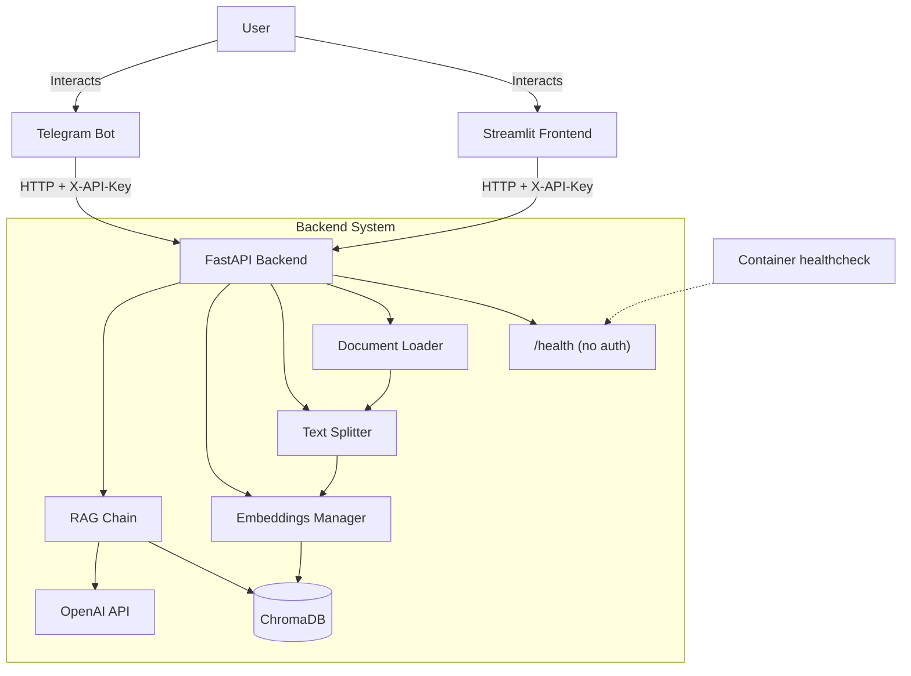

# 📄 Multi-language RAG Document Assistant - Technical Documentation

A RAG (Retrieval-Augmented Generation) assistant that lets users query their own documents
(PDF, DOCX, Markdown, TXT) in multiple languages with source attribution.

## Key Features

- **Multi-document Support**: specialized loaders for PDF, DOCX and text files
  (`.txt`, `.md`, `.markdown`), with charset detection for legacy text encodings.
  DOCX table cells are extracted as well, joined with ` | ` so a row stays one line.
- **Intelligent Chunking**: overlapping chunks preserve context - 1000 characters with 200 characters of overlap by default, configurable via `CHUNK_SIZE` / `CHUNK_OVERLAP`.
- **Multilingual Support**: explicit prompt rules for English, Russian, Kazakh, French,
  German, Spanish, Chinese, and Japanese, plus an `Auto` mode that mirrors the question.
- **RAG Architecture**: ChromaDB for vector storage, OpenAI for embeddings and generation.
- **Source Attribution**: answers ship with a separate list of source filenames and
  200-character previews. Inline citation markers are stripped from the answer text.
- **Modern UI**: Streamlit, responsive for desktop and mobile.
- **API**: FastAPI backend, guarded by a shared-secret header.
- **Telegram Bot**: full bot integration for mobile access.
- **Tenant Separation**: a `user_id` on every chunk keeps document sets apart. See
  [Tenant separation and the trust model](#tenant-separation-and-the-trust-model) for
  what this does and does not guarantee.

## System Architecture



### Components

1.  **Frontend (`frontend/`)**:
    -   Built with Streamlit.
    -   Handles file uploads and the question/answer interface.
    -   Communicates with the backend over REST.

2.  **Clients (`clients/`)**:
    -   `backend.py`: configuration and the error wording both clients share.
        They used to keep their own diverging copies of it.
    -   `telegram_bot.py`: the Telegram bot, built with `python-telegram-bot`.
        Supports document uploads (PDF/DOCX/Markdown/TXT) and text queries, and keeps the
        chosen answer language in per-user state. Run it with
        `python -m clients.telegram_bot`.
    -   The bot lived in `telegram/` until Stage 3. That name collides with the
        installed `python-telegram-bot` package - harmless only because the
        directory had no `__init__.py`, and already enough to make two ruff
        versions sort its imports differently.

3.  **Backend (`app/`)**:
    -   **API (`main.py`)**: exposes `/upload`, `/query`, `/documents` (list and
        delete), `/clear`, and `/health`.
        `create_app()` is an application factory; components are built once during
        `lifespan` startup and stored on `app.state`.
    -   **Configuration (`config.py`)**: a single pydantic-settings `Settings` class is the
        one source of truth. Components receive values from it rather than reading the
        environment themselves.
    -   **Document Loader (`rag/document_loader.py`)**: parses files and extracts metadata.
    -   **Text Splitter (`rag/text_splitter.py`)**: recursive semantic chunking.
    -   **Embeddings Manager (`rag/embeddings.py`)**: OpenAI embeddings plus ChromaDB
        persistence, over a `chromadb.PersistentClient`.
    -   **RAG Chain (`rag/chain.py`)**: retrieval and generation with language rules.

## Installation & Setup

### Prerequisites

- Python 3.10 - the version used by the Docker image, CI, and the ruff target.
- An OpenAI API key.
- A Telegram bot token (only if you run the bot).

### Steps (Manual)

1.  **Clone the repository**
    ```bash
    git clone <repository-url>
    cd Multi-language-RAG-Document-Assistant
    ```

2.  **Create and activate a virtual environment**
    ```bash
    python -m venv .venv
    source .venv/bin/activate  # On Windows: .venv\Scripts\activate
    ```

3.  **Install dependencies**
    ```bash
    pip install -r requirements.txt
    ```

4.  **Configure the environment**

    Copy `.env.template` to `.env` and fill it in:
    ```env
    OPENAI_API_KEY=sk-...
    # Shared secret every client sends as X-API-Key. Use a long random ASCII
    # string. Empty disables authentication (development only).
    BACKEND_API_KEY=<long-random-string>
    TELEGRAM_BOT_TOKEN=...        # only needed for the bot
    MODEL_NAME=gpt-4o-mini
    TEMPERATURE=0
    ```
    `OPENAI_API_KEY` has no default: without it the process aborts at startup with a
    pydantic `ValidationError`.

### Run locally

```bash
uvicorn app.main:app --reload --port 8000      # backend
streamlit run frontend/streamlit_app.py        # web UI
python -m clients.telegram_bot                 # bot
```

### Development

```bash
pip install -r requirements-dev.txt
ruff check app frontend clients evaluation tests
pytest -q
```

### Dependencies and the lock files

`requirements.txt` and `requirements-dev.txt` are the **input specs** - they pin
the direct dependencies only. `requirements.lock` and `requirements-dev.lock` are
the **fully resolved** sets: every transitive package pinned, with SHA-256 hashes.

Why both: pinning only the direct dependencies left ~130 transitive ones
floating, and that is exactly how an incompatible `posthog` release started
logging an error on every startup. The Docker image and CI install from the
locks, so a build is reproducible and `pip` refuses any artifact whose hash does
not match.

The locks are resolved **for linux / CPython 3.10** - the image and CI. On a
Windows or macOS development machine, install from `requirements.txt` instead;
the hashes in the lock refer to Linux wheels.

To change a dependency: edit the input spec, then regenerate **both** locks and
commit them together.

```bash
pip install uv==0.12.5

uv pip compile requirements.txt \
  --python-platform linux --python-version 3.10 \
  --generate-hashes --no-strip-extras \
  --output-file requirements.lock

uv pip compile requirements.txt requirements-dev.txt \
  --python-platform linux --python-version 3.10 \
  --generate-hashes --no-strip-extras \
  --output-file requirements-dev.lock
```

Compiling *into* the existing files is deliberate: uv reads them as version
preferences, so a new upstream release does not silently move an unrelated pin.
Forgetting to regenerate is caught twice - by `tests/test_lockfile.py` locally
and by the `lock` job in CI, which recompiles and fails on any diff.

`--no-strip-extras` is not optional. uv strips extras by default, which records
`uvicorn==0.29.0` instead of `uvicorn[standard]==0.29.0`. chromadb then asks pip
for `uvicorn[standard]`, pip treats the extra-decorated name as a separate
unpinned requirement, and `--require-hashes` refuses the whole file. The Docker
build is what caught this; no local check could.

The suite is **offline by construction**: an autouse fixture replaces OpenAI embedding
calls with deterministic local vectors, and `RAGChain` takes an injected client, so no test
reaches the network. `OPENAI_API_KEY` must still be set to any non-empty value.
`pyproject.toml` sets `testpaths = ["tests"]`, so a bare `pytest` collects only that
directory.

## Docker Deployment

`docker compose` automatically merges `docker-compose.override.yml` on top of
`docker-compose.yml`, so the two modes are:

```bash
# Development - bind-mounts the working tree, runs the API with --reload
docker compose up --build

# Production - code baked into the image, detached, no override
docker compose -f docker-compose.yml up -d --build
```

This starts:
- **Backend API**: `http://127.0.0.1:8000` - published on the **loopback interface only**
  (`127.0.0.1:8000:8000`). Other hosts reach it only through the frontend/bot on the
  internal `rag_net` network, or through a reverse proxy you add yourself.
- **Streamlit Frontend**: `http://localhost:8501` - published on all interfaces.
- **Telegram Bot**: connects to Telegram over outbound polling.

The frontend and bot wait for the backend's `depends_on: service_healthy` gate, which is
driven by the `/health` probe. Both receive `BACKEND_URL=http://backend:8000` from the
`environment:` block, which takes precedence over any `BACKEND_URL` in `.env`; every other
variable arrives via `env_file: .env`.

The `bot` service requires a valid `TELEGRAM_BOT_TOKEN` - without one the container exits
and restarts continuously. To run without it: `docker compose up backend frontend`.

Uploads and the vector database live in the named volumes `data_uploads` and `data_chroma`,
so they survive `docker compose down` (use `down -v` to discard them).

## Usage

### 1. Backend API
Interactive docs at `http://localhost:8000/docs`. Every endpoint except `GET /health`
requires the `X-API-Key` header.

### 2. Streamlit Web Interface
Open `http://localhost:8501`. Upload in the sidebar, ask in the main pane.

### 3. Telegram Bot
1. Send `/start` and pick an answer language.
2. Attach a document (PDF, DOCX, Markdown or TXT).
3. Send any plain text message to ask a question.
4. `/documents` lists what is indexed; `/clear` removes all of it;
   `/help` shows usage.

## API Reference

**Authentication.** Every endpoint below except `GET /health` requires the header
`X-API-Key: <BACKEND_API_KEY>` and answers `401` otherwise. If `BACKEND_API_KEY` is empty
the check is skipped entirely - development only, and a warning is logged at startup.

`user_id` is **required** everywhere and must match `^[A-Za-z0-9_-]{1,64}$`; anything else
is rejected with `422`. It doubles as a directory name and a metadata filter value, which
is why it is restricted.

**Every response** carries an `X-Request-ID` header. Send your own to have it
kept (`[A-Za-z0-9._-]`, up to 64 characters); anything else is replaced. See
Observability below.

### `GET /health`
Liveness probe: the process is answering. **No authentication.**
-   **Response**: `{"status": "ok", "version": "0.2.0"}`
-   Says nothing about whether a query would work - use `/ready` for that.

### `GET /ready`
Readiness probe: whether the components a request needs are usable.
**No authentication** - an orchestrator's probe has no API key.
-   **Response (ready)**: `200` with
    `{"status": "ready", "checks": {"startup": "ok", "vector_store": "ok"}}`
-   **Response (not ready)**: `503` with the same shape and `"failed"` against
    the check that failed. Never *why*: the endpoint is unauthenticated and an
    exception message can carry a filesystem path.
-   Used by the Compose healthcheck, so `depends_on: service_healthy` means
    "can serve" rather than "has a socket open".

### `POST /upload`
Uploads and indexes a document.
-   **Body**: `multipart/form-data` with `file` (`.pdf`, `.docx`, `.txt`, `.md`,
    `.markdown`). The list lives in `SUPPORTED_EXTENSIONS` in
    `app/rag/document_loader.py`, which the API gate and both clients read.
-   **Query Parameters**: `user_id` (**required**, see above).
-   **Response (indexed)**:
    ```json
    {"message": "Document processed successfully", "filename": "report.pdf",
     "chunks": 15, "duplicate": false, "file_hash": "a1b2c3d4e5f60718",
     "replaced": false}
    ```
    `file_hash` is the handle the document endpoints below take.
-   **Response (duplicate)** - the same bytes were already indexed for this `user_id`
    (deduplicated by SHA-256 of the file content):
    ```json
    {"message": "Document already indexed (identical content)", "filename": "report.pdf",
     "chunks": 0, "duplicate": true, "file_hash": "a1b2c3d4e5f60718",
     "replaced": false}
    ```
-   **Revisions**: uploading a **different** file under a name this `user_id` already
    used replaces the earlier revision - its chunks and its stored file are removed and
    `replaced` comes back `true`. Both revisions used to stay indexed and answer the
    same question, with nothing telling the reader which sentence came from which.
-   **Errors**:
    -   `400` - unsupported extension, empty file, no extractable text, a corrupt or
        unparseable document, or a file larger than `MAX_FILE_SIZE`.
    -   `401` - bad or missing `X-API-Key`.
    -   `413` - this upload would take the owner past `MAX_DOCUMENTS_PER_USER` or
        `MAX_BYTES_PER_USER`. The detail carries the numbers and the remedy. An
        identical re-upload still succeeds at the limit (it adds nothing), and a new
        revision of an existing filename is judged after the old revision is
        discounted (it replaces it). See Quotas and retention.
    -   `422` - missing or malformed `user_id`.
    -   `503` - the vector store rejected the write (retryable).

### `POST /query`
Asks a question against the indexed documents.
-   **Body**: `{"question": "...", "language": "Auto", "user_id": "...",
    "history": [{"question": "...", "answer": "..."}]}`.
    `question` must be 1-4000 characters; `history` is optional, holds at most
    20 turns and is what makes a follow-up work (see
    [Follow-up questions](#follow-up-questions)); `language` is one of the values in
    [Supported languages](#supported-languages), defaulting to `Auto`. An unrecognised
    value falls back to `Auto` behaviour rather than failing.
-   **Response**:
    ```json
    {"answer": "...",
     "sources": [{"id": 1, "source": "report.pdf", "preview": "first 200 chars…"}]}
    ```
    Sources are deduplicated by filename and numbered from 1. When nothing is retrieved
    the call still succeeds with `"No relevant information found."` and an empty
    `sources` list - the language model is not invoked.
-   **Errors**:
    -   `401` - bad or missing `X-API-Key`.
    -   `422` - validation (question length, `user_id` shape).
    -   `429` - the model provider rate limited us. Retryable; a `Retry-After`
        header says how long to wait.
    -   `504` - the model did not answer within `OPENAI_TIMEOUT`. Retryable.
    -   `503` - retrieval or generation failed for another reason.

### `POST /query/stream`
The same question, answered as it is generated. `/query` is unchanged; this is
an addition.

-   **Body**: identical to `/query`.
-   **Response**: `text/event-stream`. Each event is a `data:` line holding one
    JSON object:
    ```
    data: {"type": "sources", "sources": [{"id": 1, "source": "report.pdf", "preview": "..."}]}
    data: {"type": "token", "text": "Revenue "}
    data: {"type": "token", "text": "grew "}
    data: {"type": "done"}
    ```
    Sources arrive **first**, before any token: they are known as soon as
    retrieval finishes. Concatenating every `token` gives the same answer
    `/query` would have returned.
-   **Errors**: retrieval and the condensing call a follow-up needs both happen
    before the first byte, so their failures are ordinary status codes -
    `401`, `422`, `429`, `504`, `503`, exactly as on `/query`. A failure *after*
    the response has started cannot change a status line that is already sent,
    so it arrives as a final `{"type": "error", "detail": "..."}` event.
-   The response sets `Cache-Control: no-cache` and `X-Accel-Buffering: no`;
    a proxy that buffers the body defeats the entire feature.

### `GET /documents`
Lists what this `user_id` has indexed, one entry per document rather than per chunk.
-   **Query Parameters**: `user_id` (**required**).
-   **Response**:
    ```json
    {"documents": [{"file_hash": "a1b2c3d4e5f60718", "source": "report.pdf",
                    "chunks": 15, "type": "pdf", "pages": 4}],
     "total_chunks": 15,
     "quota": {"documents": 1, "max_documents": 200,
               "bytes": 348160, "max_bytes": 1073741824}}
    ```
    Sorted by filename, case-insensitively. `pages` is `null` for text files.
    `quota` is where this owner stands against the per-owner limits, so a limit is
    visible before it is hit; a max of `0` means that limit is off. `bytes` counts
    only files that back a listed document.
-   **Errors**: `401`, `422`, `503` (vector store unavailable).

### `DELETE /documents/{file_hash}`
Removes one document: its chunks **and** the raw file behind it.
-   **Path Parameters**: `file_hash` - 16 lowercase hex characters, as returned by
    `/upload` and `GET /documents`.
-   **Query Parameters**: `user_id` (**required**).
-   **Response**:
    ```json
    {"message": "Document deleted", "file_hash": "a1b2c3d4e5f60718", "chunks_removed": 15}
    ```
-   Scoped to the owner: the identical file held by another `user_id` is untouched,
    and deleting a hash you do not own is a `404`, not a silent success.
-   **Errors**: `401`, `404` (no such document for this owner), `422` (malformed hash
    or `user_id`), `503`.

### `POST /feedback`
Records one rating of one answer. Requires `FEEDBACK_ENABLED`.
-   **Body**: `{"rating": "up"|"down", "user_id": "...", "question": "...",
    "answer": "...", "sources": ["policy.docx"], "request_id": "...",
    "comment": "...", "language": "...", "client": "web"}`. Only `rating`,
    `user_id` and `question` are required; `request_id` is the `X-Request-ID` of
    the request being rated.
-   **Response**: `{"message": "Thanks - recorded."}`
-   **Errors**: `401`, `404` (collection disabled), `422`,
    `507` (the file is at `FEEDBACK_MAX_BYTES`), `503` (the write failed).
-   The client sends the exchange rather than the server remembering it, so the
    API stays stateless and a replica that did not serve the query can still
    take the rating.

### `POST /maintenance/sweep`
Finds namespaces nobody has touched in `idle_days` and, when asked twice, removes
them. Runs inside the backend because ChromaDB must have a single writer - the same
reason backup and restore insist the backend is stopped. Meant to be called by
`python -m scripts.sweep`.
-   **Query Parameters**: `idle_days` (**required**, `1`-`3650`), `prefix`
    (**required**; the empty string means every owner, and has to be written into
    the request on purpose), `apply` (default `false` = dry run), `force` (default
    `false`).
-   **Response**: `200` with
    ```json
    {"idle_days": 30, "prefix": "web-", "dry_run": true,
     "cutoff": "2026-07-27T12:00:00+00:00", "newest_seen": "2026-08-26T09:14:02+00:00",
     "candidates": [{"user_id": "web-3f1c...", "documents": 2, "bytes": 51200,
                     "last_seen": "2026-06-30T08:00:00+00:00"}],
     "empty": [], "unknown": [], "foreign": ["tmp restore"],
     "orphans": [{"user_id": "12345", "files": 1, "bytes": 4096, "in_scope": false}],
     "swept": [], "became_active": [], "failed": [], "orphans_removed": 0,
     "refused": null}
    ```
    Every owner **matching the prefix** is in exactly one of `candidates` (idle,
    with something to delete), `empty` (idle, only a marker or an empty directory
    left), `unknown` (nothing dates it - never swept) or not listed at all, which
    means it is active. `foreign` is
    names on disk that cannot be a `user_id` and are never acted on. `orphans` is
    stored files with no vectors behind them, per owner: reported for **every**
    owner, since they are most likely under the stable ids a `web-` prefix
    excludes, but removed on apply only for owners inside the prefix - `in_scope`
    says which. An operator who asked to sweep web sessions should not have files
    deleted elsewhere.
-   **Refusals**: with `apply=true` and no `force`, the sweep declines - `200`,
    `dry_run: true`, `refused` set to the reason, nothing deleted - when the
    prefix is empty, when `idle_days` is below 7, when activity writes have failed
    since startup, or when no owner at all has been seen inside the window (after a
    restore or a long stop that is stale data, not a mass departure).
-   **Errors**: `401`, `422`, `503` (vector store unavailable).

### `POST /clear`
Deletes the caller's documents: both the vectors **and** the raw uploaded files on disk.
-   **Query Parameters**: `user_id` (**required**).
-   **Response**: `{"message": "Documents cleared successfully"}`
-   **Errors**: `401`, `422`, `500` (deletion failed).

## Quotas and retention

Until Stage 15 the only bound was `MAX_FILE_SIZE`, on one file. One `user_id` could
fill the volume the vector store lives on, and every upload was paid embedding calls
with no ceiling.

**Per-owner limits.** `MAX_DOCUMENTS_PER_USER` (200) and `MAX_BYTES_PER_USER` (1 GiB)
bound what one owner may hold. An upload that would cross either is refused with
`413` and a message naming the numbers and the remedy. They ship on - unlike
`RELEVANCE_THRESHOLD` and `MMR_LAMBDA`, which ship off - because of how they fail: a
wrong threshold silently drops relevant context, an exceeded quota is loud. `0`
disables a limit (unlike `MAX_FILE_SIZE`, where `0` is rejected). The check happens
after deduplication, so an identical re-upload succeeds at the limit, and a new
revision of an existing filename is judged with the old revision discounted. Bytes
are counted only for files that back a listed document; a file with no vectors
behind it is invisible in `/documents` and cannot be deleted through the API, so
counting it would present a limit there is no way to get under.

Both clients show the usage line from `GET /documents` (`3 of 200 documents, 12 KB
of 1 GB`; with a limit off, just the usage). The message names no setting - that
goes to the backend log at WARNING, where the person who can change it is reading.

Uploads from one owner are serialized in-process: the quota check is a read
followed by a write, and two uploads arriving together would both read "room for
one more". The lock is striped (64 stripes), because the web UI mints a new owner
per browser session and a lock per `user_id` would grow for as long as the process
lived. The guarantee is per process, which the single-writer ChromaDB constraint
already makes the only deployment shape.

Quotas are keyed on `user_id`, which is unauthenticated client input. They protect
against accidents and runaway cost, not abuse: anyone holding the shared key can
pick another `user_id`.

**Activity.** Each owner has a marker file under `UPLOAD_DIR/.activity/`, touched by
a successful upload, question, listing (of a non-empty namespace), delete or rating.
`last_seen` is the newer of the marker and the owner's newest uploaded file, so
an upload in flight cannot be mistaken for idleness. Owners
from before markers existed are seeded at startup, so "idle" means "idle since the
upgrade" - dating them by their newest upload would be a lower bound on activity,
and a lower bound can only make a live owner look more idle than they are. Markers
travel with backups; a restore dates them all now, since restoring last month's
snapshot would otherwise make everyone look a month idle by construction.

**The sweep.** The web UI's `web-<uuid>` namespaces are orphaned the moment a tab
closes and can never be reached again - and since Stage 14 they are copied into
every backup. `python -m scripts.sweep` lists namespaces idle for 30+ days under the
`web-` prefix; `--apply` removes them. Telegram ids are digit-only, so that prefix
can never match a Telegram user; sweeping every tenant needs an explicit
`--prefix ""` and, on the backend, `force`.

```bash
python -m scripts.sweep                          # dry run
python -m scripts.sweep --apply                  # remove idle web sessions
docker compose run --rm bot python -m scripts.sweep --apply
```

In Compose the sweep runs from the `bot` service: it needs the backend up (unlike
backup and restore), and the bot carries `BACKEND_URL=http://backend:8000` and the
API key. A one-off `backend` container would ask `localhost` and find nobody.

Everything about the sweep is arranged around the one mistake it can make. Dry run
is the default. An owner nothing dates is reported as unknown and never removed.
`apply` refuses on its own - and says why - without a prefix, below 7 idle days,
after any failed activity write since startup, and when no owner at all has been
seen inside the window. Each deletion is logged before it happens, so a crash
mid-loop leaves a record; each owner is re-checked under its upload lock right before
removal, so one who came back while the list was being built is spared; one failure
is recorded and the loop goes on. Orphan files - stored files with no vectors behind
them - are reported for every owner and removed on apply only inside the prefix,
under the same lock; the script says how many it is leaving alone.

There is no automatic schedule: run it from cron, and read a dry run first.

## Backup and restore

Everything this assistant knows lives in three directories: the ChromaDB index
(`CHROMA_PERSIST_DIR`), the raw uploads (`UPLOAD_DIR`) and the collected ratings
(`FEEDBACK_DIR`). All three are named volumes in the shipped Compose file. Losing
them lost everything, and there was no procedure - not even a list of what to
copy.

**Stop the backend first.** ChromaDB is a SQLite database plus HNSW index files
written separately; a copy taken while something is writing can catch the two out
of step, and nothing a script does can fix that. Both commands check whether the
backend answers and refuse if it does. `--live` overrides that where a minute of
downtime is worse than a small risk.

```bash
docker compose stop backend
docker compose run --rm -v "$PWD/backups:/backups" backend     python -m scripts.backup --output /backups
docker compose start backend
```

Or on the host, against a local `.env`:

```bash
python -m scripts.backup --output data/backups
```

The archive is one `rag-backup-YYYYMMDD-HHMMSS.tar.gz` holding `chroma/`,
`uploads/`, `feedback/` and a `manifest.json`. No OpenAI key is needed: it only
copies files.

**What the manifest is for.** An archive alone says nothing about whether it fits
the deployment being restored into. It records the embedding model, the
collection name, the chunking, a count of chunks, uploads and ratings, and a
SHA-256 of every file. Restore verifies each hash and refuses on a mismatch, and
refuses when the embedding model or the collection name differ - vectors built by
one model are not visibly wrong to another, only quietly meaningless, which is
the same failure the startup guard in `embeddings.py` exists to prevent. A
chunking difference is not refused: it changes what future uploads look like, not
what existing vectors mean.

```bash
python -m scripts.restore data/backups/rag-backup-20260825-132254.tar.gz --inspect
python -m scripts.restore data/backups/rag-backup-20260825-132254.tar.gz --overwrite
```

`--inspect` reports what an archive holds and whether it fits, and writes
nothing. Without `--overwrite`, a restore onto directories that already hold data
is refused; an empty directory does not count as data, because Docker creates the
mount points before anything is in them. Every check runs before anything on disk
is touched, so a refusal leaves the current data exactly as it was. `--force`
restores over an incompatibility and says what it ignored.

An archive is treated as untrusted input even though only an operator can supply
one: a member whose path escapes the target, or any symlink, aborts the restore.

**There is deliberately no backup endpoint.** The API's only credential is one
shared secret, so a route that returned the whole corpus would be a
data-exfiltration endpoint wearing a useful name. Snapshots are an operator task
on the volume.

**What is not covered.** `.env` - it holds the API keys and is the operator's to
keep. And this is a snapshot tool, not a schedule: run it from cron or a systemd
timer, and keep the archives somewhere other than the host that made them.

## Answer feedback

The golden set in `evaluation/golden.py` is questions *I* wrote. It guards the
properties worth protecting, but it measures guesses about what people ask. A
thumbs-down is the opposite: a real question that got a real bad answer, with the
documents that produced it and the request id that finds it in the log.

Both clients put 👍/👎 under each answer. The web UI keeps the rating in session
state so the buttons give way to an acknowledgement; the bot uses an inline
keyboard and removes it once pressed, because a second press would record a
second rating of the same answer. Telegram allows 64 bytes of callback data, far
too little for a question, so the button carries the request id and the bot holds
the last 20 exchanges per chat to look it up. After a restart it holds none, and
a press then says the answer is too old to rate rather than sending a rating with
an empty question.

Records land in `FEEDBACK_DIR/feedback.jsonl`, one JSON object per line:

```json
{"at": "2026-08-25T12:12:32+00:00", "rating": "down", "user_id": "42",
 "question": "Сколько дней отпуска у инженера?", "answer": "...",
 "sources": ["policy.docx"], "request_id": "bb42c28f0a211d46",
 "comment": "Ответил про директора", "language": "Auto", "client": "telegram"}
```

**Only rated exchanges are stored.** Logging every question would be a larger
privacy decision taken on the operator's behalf; pressing a button is the user
saying "look at this one". `FEEDBACK_ENABLED=false` turns even that off - the
endpoint answers 404, the clients draw no buttons, and nothing is created on
disk. The timestamp is the server's: a client's clock is only useful for lining
up against a client's log.

The file is appended under a lock and never rotated automatically. At
`FEEDBACK_MAX_BYTES` new ratings are refused with `507` rather than filling the
volume the vector store lives on; move the file aside to start a fresh one.

To read what has been collected:

```bash
python -m evaluation.from_feedback                       # negative ratings
python -m evaluation.from_feedback --up --limit 50       # the ones people liked
```

It prints how many ratings there are, which documents are behind the negative
ones, and a `GoldenCase(...)` stub per question with `expected_sources=[]` left
blank. Deliberately blank: which document *should* have answered is a judgement
about the corpus, and a stub that guessed would turn one bad answer into a
permanently wrong benchmark.

## Observability

Two questions used to be unanswerable.

**"A user says it failed at 14:32 - which log lines are theirs?"** Every request
now gets an id. It goes into a context variable, a logging filter puts it on
every record, and the format string prints it in brackets:

```
2026-08-25 12:47:52,517 - app.main - ERROR - [bb42c28f0a211d46] Query failed
2026-08-25 12:47:52,518 - app.observability - INFO - [bb42c28f0a211d46] POST /query -> 503 in 2 ms (user=u1)
```

`grep bb42c28f0a211d46` returns that request and nothing else, including the
lines written deep in `app.rag.*` by code that knows nothing about HTTP. Lines
that belong to no request - startup, background work - print `[-]` rather than
borrowing an id.

The id comes back in the `X-Request-ID` response header, and in the body of a
`500`. Both clients show it to the user, but only for failures the user cannot
fix themselves - a rejected key, a crash, a backend that gave up. On "unsupported
file format" it would be noise, because the message already says what to change.

A caller may supply the id (a proxy or a client-side trace). It is kept if it
matches `[A-Za-z0-9._-]{1,64}` and replaced otherwise: the value reaches the log
and the response, so a newline in it would let a caller forge log lines. The
same applies to `user_id` in the access line, which is written for rejected
requests too and so has not been validated at that point.

One access line is written per request, with the status, the duration and the
owner. `/health` and `/ready` are logged only when they *fail*: the Compose
healthcheck polls every 15 seconds and would otherwise bury real traffic.

uvicorn writes an access line of its own, through its own handler, and it has no
request id - so each request appears twice in the log. Ours is the line with the
id, the duration and the owner; run uvicorn with `--no-access-log` to keep only
that one.

**"Is the backend ready, or merely running?"** `/health` answers 200 as soon as
the process accepts a socket, which happens before the vector store is open. An
orchestrator routing on `/health` sends traffic into 503s. `/ready` checks that
startup finished and that the store is readable, and Compose's healthcheck uses
it so `depends_on: service_healthy` means "can serve".

`/ready` deliberately does **not** call OpenAI. Readiness would then depend on a
third party's availability and quota, and one rate limit would pull every replica
out of the load balancer while the backend was perfectly able to serve. A failing
OpenAI call surfaces as a `429` or `504` on the request that needed it, which is
where it belongs.

The readiness check reads through `EmbeddingsManager.ping()` rather than
`count()`. `count()` answers 0 for a collection that was never opened, which is
indistinguishable from an empty one - the first version of the check passed while
the store was unusable, which is how this was found.

## Supported formats

| Extension | Loader | Notes |
| --- | --- | --- |
| `.pdf` | `PyPDFLoader` | One document per page, so citations can name a page. |
| `.docx` | `python-docx` | Paragraphs and table cells. |
| `.txt` | built-in | Charset detection for legacy encodings. |
| `.md`, `.markdown` | built-in | Markdown syntax is kept, not stripped. |

The list is `SUPPORTED_EXTENSIONS` in `app/rag/document_loader.py`. The API's
extension gate and both clients' file pickers read it, so a new format is added
in one place rather than four; a test asserts none of them keeps its own copy.

**DOCX tables.** `python-docx` does not include table text in
`document.paragraphs`, so a loader that reads only paragraphs indexes the prose
around the answer and not the answer - in these documents the rates, dates and
headcounts a person asks about are usually in a table. Each row becomes one line
with cells joined by ` | `, which keeps a value attached to its label; a merged
cell, which `python-docx` repeats once per column it spans, is emitted once.
Headers, footers and footnotes are **not** read.

**Markdown** goes through the text loader unchanged. Its syntax carries meaning a
reader relies on - a heading says what a section is about - so stripping it to
bare prose would discard structure the model can use. The document listing
reports the real extension (`md`), not `txt`.

**The old `.doc` format** (pre-2007 binary) is not supported and `python-docx`
cannot read it. Uploading one is rejected with instructions to re-save as
`.docx` or export to PDF, because "unsupported format" tells the person nothing
they can act on.

## Supported languages

`Auto` (mirror the question), `English`, `Русский`, `Қазақша`, `Français`, `Deutsch`,
`Español`, `中文`, `日本語`. The list is shared by the chain's prompt rules and both
clients' pickers; a test asserts they do not drift apart.

## Tenant separation and the trust model

Documents are separated by a `user_id` stored on every chunk:
- On upload, `user_id` is written into each chunk's metadata, and the raw file is stored
  under `data/uploads/<user_id>/<content-hash>_<filename>`.
- On query, retrieval is filtered by that `user_id`.
- Chunk IDs are `"<user_id>-<file_hash>-<index>"`, so one owner's re-upload cannot
  overwrite another's vectors.
- Deduplication is scoped to the owner too: an unscoped content-hash lookup would reveal
  whether *other* users hold a given file.

**What this is not.** `user_id` is unauthenticated client input, not an authorization
boundary. The only real credential is the single shared `BACKEND_API_KEY`, so anyone who
holds it can pass any `user_id` and read or clear that namespace. Treat the API as
trusted-network infrastructure: keep it on loopback or a private network (as the shipped
Compose file does) and treat the separation as *tenant scoping between cooperating
clients*, not as security between mutually distrusting users. Per-user authentication is
future work. The same applies to the per-owner quotas (accidents and runaway cost, not
abuse) and to `POST /maintenance/sweep`, which lets a key holder list idle tenants and
remove many at once: `/clear` already allowed removing any tenant with the key, so this
does not widen the boundary, but it does make enumeration easier.

Client-side identities:
- **Streamlit** mints a fresh per-session id `web-<uuid4-hex>`. Reloading the page starts
  an empty namespace; documents uploaded earlier stay on the backend but are no longer
  reachable from the UI. The sweep (see Quotas and retention) is how those are
  eventually removed.
- **Telegram bot** uses the Telegram user id, which is stable across sessions.

## Configuration

Every field of `app/config.py`'s `Settings` is settable as an upper-case environment
variable of the same name, read from `.env` or the process environment.

| Variable | Description | Default |
| :--- | :--- | :--- |
| `OPENAI_API_KEY` | **Required.** Your OpenAI API key; startup fails without it. | - |
| `BACKEND_API_KEY` | Shared secret for the `X-API-Key` header. Empty disables auth (development only). Must be ASCII. | `""` |
| `MODEL_NAME` | Chat model used for generation. | `gpt-4o-mini` |
| `EMBEDDING_MODEL` | OpenAI embedding model. Recorded in the collection; changing it against an existing collection is refused at startup. | `text-embedding-3-small` |
| `TEMPERATURE` | Sampling temperature, `0.0`-`2.0`. | `0.0` |
| `TOP_K_RESULTS` | Chunks retrieved per question, `>= 1`. | `5` |
| `RELEVANCE_THRESHOLD` | Cosine similarity a chunk must reach to enter the prompt, `0.0`-`1.0`. `0` keeps every candidate. | `0.0` |
| `MAX_HISTORY_TURNS` | Past exchanges a follow-up may draw on, `0`-`20`. `0` disables multi-turn. | `6` |
| `MMR_LAMBDA` | Diversity of retrieved chunks, `0.0`-`1.0`. `1.0` ranks by relevance alone. | `1.0` |
| `MAX_ANSWER_TOKENS` | Cap on generated answer length, `>= 1`. Without it a completion is unbounded at your expense. | `1000` |
| `OPENAI_TIMEOUT` | Seconds the OpenAI client waits. Keep it below the clients' own timeouts. | `45.0` |
| `OPENAI_MAX_RETRIES` | Retries the OpenAI client makes on a transient failure. | `2` |
| `OPENAI_BASE_URL` | Azure or an OpenAI-compatible endpoint (vLLM, Ollama). Empty means api.openai.com. | `""` |
| `CHUNK_SIZE` | Characters per chunk, `>= 1`. | `1000` |
| `CHUNK_OVERLAP` | Overlap between chunks; must be **smaller** than `CHUNK_SIZE`. | `200` |
| `CHROMA_PERSIST_DIR` | ChromaDB storage directory. | `./data/chroma_db` |
| `COLLECTION_NAME` | ChromaDB collection name. | `documents` |
| `UPLOAD_DIR` | Where raw uploads are stored. | `data/uploads` |
| `MAX_FILE_SIZE` | Maximum accepted upload, in bytes. | `31457280` (30 MB) |
| `MAX_DOCUMENTS_PER_USER` | Documents one owner may hold. An upload past it is a `413`. `0` = unlimited. | `200` |
| `MAX_BYTES_PER_USER` | Bytes of uploaded files one owner may hold. `0` = unlimited. | `1073741824` (1 GiB) |
| `FEEDBACK_ENABLED` | Whether answers can be rated. Off makes `POST /feedback` answer 404 and creates nothing on disk. | `True` |
| `FEEDBACK_DIR` | Where `feedback.jsonl` is written. | `data/feedback` |
| `FEEDBACK_MAX_BYTES` | Cap on that file. At the cap new ratings are refused with 507 instead of filling the volume. | `10485760` (10 MB) |
| `TELEGRAM_BOT_TOKEN` | Required by the bot only; read directly by `clients/telegram_bot.py`. | - |
| `BACKEND_URL` | Backend base URL used by the frontend and bot. Compose overrides it to `http://backend:8000`. | `http://localhost:8000` |

Invalid combinations are rejected at startup rather than at first use - for example
`CHUNK_OVERLAP >= CHUNK_SIZE`, a negative `TOP_K_RESULTS`, or a non-ASCII
`BACKEND_API_KEY` (HTTP headers cannot carry non-ASCII, so such a key could never match).

### Streaming

The Streamlit UI uses `/query/stream`, so an answer appears word by word
instead of after a five to fifteen second pause on a motionless spinner. The
Telegram bot deliberately does not: streaming there means editing a message
repeatedly, which runs into Telegram's edit rate limits, and the typing
indicator already tells the user something is happening.

Citation markers are stripped from the stream as it passes. That needs more
than the regex `/query` uses, because `[1]` can arrive as `[`, `1`, `]` in
three separate chunks and a per-chunk regex would let all three through. The
filter holds back only what could still become a marker, so at most a few
characters are ever delayed, and an unterminated `[12` at the end of a stream
is released as the real text it turned out to be.

### Follow-up questions

"And the second one?" embeds to nothing useful: retrieval matches those literal
words rather than what the user meant, so a follow-up used to pull back
unrelated chunks and the answer degraded exactly when the conversation got
going.

The client sends the recent exchanges in `history`, and when it is non-empty the
backend makes one extra model call to rewrite the follow-up as a standalone
question. **Retrieval uses the rewrite; the answer still addresses the question
as asked**, with the conversation included for context.

The history lives with the client, not the server: the API stays stateless, and
there are no sessions to expire or clean up. `MAX_HISTORY_TURNS` bounds how many
exchanges are used (0 disables the feature entirely and restores exactly the old
single-turn behaviour), and the request schema caps the list at 20 turns
regardless. A first question makes no extra call, so the common case costs
nothing new, and if the rewrite fails the original question is used - a
condensing hiccup degrades the answer rather than breaking the request.

### Chunk diversity (MMR)

Chunks overlap by `CHUNK_OVERLAP` characters, so the neighbours of a strong
match are strong matches too, and the top `TOP_K_RESULTS` can be one passage
repeated. That is not hypothetical. On a nine-chunk corpus where one document
supplied six of them, the question *"How is electricity generated and stored?"*
returned five chunks about generation and nothing about storage - the document
that answered the second half never appeared.

`MMR_LAMBDA` re-ranks candidates to trade a little relevance for coverage: each
pick maximises `lambda * relevance - (1 - lambda) * closest_already_picked`.
Candidates are fetched four times over, so there is something to choose between,
and `RELEVANCE_THRESHOLD` is applied **first** - otherwise diversity spends a
slot on a chunk that is merely different rather than different and relevant.

It ships at `1.0`, meaning off, and the measurement is why rather than caution:

| lambda | recall@5 | precision@5 | MRR | distinct documents in top-5 |
| :--- | :--- | :--- | :--- | :--- |
| 1.0 (off) | 0.875 | **0.600** | 1.000 | 2.00 |
| 0.9 | 0.875 | 0.550 | 1.000 | 2.25 |
| 0.8 | 0.875 | 0.400 | 1.000 | 3.00 |
| 0.7 | **1.000** | 0.350 | 1.000 | 4.00 |
| 0.5 | 1.000 | 0.350 | 1.000 | 4.00 |

The recall gain arrives only once precision has already fallen from 0.60 to
0.35: a question about a single topic then carries three unrelated chunks into
its prompt. MRR stays at 1.0 throughout, so the best match is never displaced -
the cost is dilution, not a worse top answer. Whether that trade is worth making
depends on how many questions span several documents, which this repository
cannot know. Measure it with `evaluation/run_eval.py` on your own corpus.

Diversity needs the candidate vectors, which the ChromaDB collection returns
alongside the distances in the same query - re-embedding the candidates would
double the embedding bill on every question. If the chain is ever constructed
without an embeddings manager, MMR logs a warning once and stays inactive
rather than pretending to be on.

### Measuring retrieval

Every retrieval knob - `TOP_K_RESULTS`, `CHUNK_SIZE`, `RELEVANCE_THRESHOLD` -
used to be set by reasoning rather than measurement. `evaluation/` has two
halves that measure different things, and conflating them is how a harness
starts lying.

**Offline, in CI** (`tests/test_retrieval_quality.py`). A small labelled corpus
is indexed with a deterministic bag-of-words embedder and run through the real
retrieval path, then scored with recall@k, precision@k and MRR. Because the
embedder is not a real one, this says **nothing about embedding quality**. What
it catches is a change that breaks filtering, ordering, chunking or tenant
scoping badly enough that the right chunk stops coming back - regressions the
rest of the suite cannot see, since its fake vectors are random and every
ranking is therefore arbitrary.

**By hand, against a live backend** (`evaluation/run_eval.py`). This is the half
with real embeddings, and the only one that can answer "what should
`RELEVANCE_THRESHOLD` be?".

```bash
python -m evaluation.run_eval --url http://127.0.0.1:8000 --api-key <key>
```

It uploads the golden corpus under a scratch tenant, asks every golden question
plus a few the corpus cannot answer, prints the metrics, and clears up after
itself. Read the backend's per-query `retrieval ... similarity_best=...` lines
alongside it: the answerable questions show what a real match scores, the
unanswerable ones show what noise scores, and the threshold belongs between
them - closer to the noise end, because one set too high drops relevant context
silently.

The golden set in `evaluation/golden.py` is deliberately small. A hundred cases
nobody re-reads rot into noise; these cover the properties worth protecting,
including a question that mentions "solar" but is about storage, and a Russian
question against a Russian document.

It is also, unavoidably, questions I made up. The way it grows out of that is
collected ratings: see Answer feedback above, and
`python -m evaluation.from_feedback` for the stubs.

Nothing in `evaluation/` ships in the image.

### Relevance filtering

Retrieval returns `TOP_K_RESULTS` chunks whether or not the corpus has anything
to do with the question, so asking about a topic you never uploaded still fills
the prompt with your nearest unrelated paragraphs. `RELEVANCE_THRESHOLD` drops
candidates below a cosine similarity; when everything is dropped the API answers
`"No relevant information found."` without calling the model at all.

It ships **disabled** (`0.0`) on purpose. The right value depends on the corpus
and the embedding model, and one set too high discards relevant context - a
failure far harder to notice than including too much. Every query logs what it
saw, so the number can come from data:

```
retrieval space=l2 candidates=5 similarity_best=0.681 similarity_worst=0.104 threshold=0.0
```

Ask a few questions you know the answers to, and a few you know are not in the
corpus, then pick a value between the two clusters.

Note the scores ChromaDB returns are **distances**, not similarities - for the
default `l2` space, `0.0` means identical. The conversion to cosine similarity
(`1 - distance/2`, exact for unit-normed OpenAI embeddings) lives in
`app/rag/embeddings.py`, and filtering disables itself with a warning if a
collection uses an index space that conversion does not cover.

### Changing the embedding model

The embedding model is recorded in the ChromaDB collection's metadata the first time
it is opened. Pointing `EMBEDDING_MODEL` at a different model afterwards **fails at
startup with an explanatory error** rather than proceeding: vectors produced by two
models are not comparable, and their dimensions usually differ outright (1536 for
`text-embedding-3-small` vs 3072 for `-large`), so mixing them silently corrupts every
subsequent search. To switch models, delete the collection directory
(`CHROMA_PERSIST_DIR`) and re-index.

## 📁 Directory Structure

```
├── app/
│   ├── main.py                 # API entry point, app factory, auth
│   ├── config.py               # pydantic-settings Settings (single source of truth)
│   ├── observability.py        # Request ids, access log, readiness checks
│   ├── feedback.py             # The rating log and the reports read off it
│   ├── backup.py               # Snapshot and restore, with a verified manifest
│   ├── activity.py             # Who was here when: the markers the sweep reads
│   ├── humanize.py             # human_size and the quota line, shared with the clients
│   ├── models/                 # Pydantic models (QueryRequest, QueryResponse)
│   ├── rag/                    # RAG core logic
│   │   ├── languages.py        # The one language table both clients derive from
│   │   ├── document_loader.py  # File parsing (PDF/DOCX/text) + charset detection
│   │   ├── text_splitter.py    # Recursive chunking
│   │   ├── embeddings.py       # Vector DB management (ChromaDB)
│   │   └── chain.py            # Retrieval + generation & prompts
│   └── docs/assets/            # Documentation assets (GIFs, images)
├── frontend/
│   └── streamlit_app.py        # Streamlit UI
├── clients/
│   ├── backend.py              # Config + error wording shared by both clients
│   └── telegram_bot.py         # Telegram bot
├── tests/                      # Offline test suite (pytest)
│   ├── conftest.py             # Fake embeddings + isolated app fixtures
│   ├── test_api.py             # Auth, validation, dedup, clear, isolation
│   ├── test_chain.py           # Language rules, citations, source list
│   ├── test_config.py          # Settings validation and wiring
│   ├── test_document_loader.py # Encoding handling
│   ├── test_embeddings.py      # Vector store operations
│   └── test_upload_errors.py   # Upload failure modes
├── evaluation/                 # Retrieval metrics, golden set, eval and feedback scripts
├── scripts/                    # Operator tooling: backup.py, restore.py, sweep.py (ships in the image)
├── .github/workflows/ci.yml    # Lint + tests + docker build
├── data/
│   ├── backups/                # Archives written by scripts/backup.py (git-ignored)
│   ├── uploads/                # Raw file storage
│   └── chroma_db/              # Persistent vector database
├── docker-compose.yml          # Production-shaped base
├── docker-compose.override.yml # Development overrides (auto-merged)
├── Dockerfile                  # Shared image for all three services
├── pyproject.toml              # ruff + pytest configuration
├── requirements.txt            # Runtime dependencies (input spec)
├── requirements-dev.txt        # Development dependencies (input spec)
├── requirements.lock           # Resolved runtime set, hashed (linux/cp310)
├── requirements-dev.lock       # Resolved runtime + dev set, hashed
└── .env.template               # Documented environment template
```

## Continuous Integration

`.github/workflows/ci.yml` runs on pushes to `main` and on every pull request,
with `concurrency` cancelling superseded runs:

- **lock**: recompiles both lock files and fails if either differs from what is
  committed - a dependency change without a regenerated lock cannot merge.
- **test**: installs `requirements-dev.lock` with `--require-hashes` on Python
  3.10 (the same transitive versions the image ships), runs
  `ruff check app frontend clients evaluation tests`, then `pytest -q` with a dummy
  `OPENAI_API_KEY`.
- **docker**: builds the image, prints its size, asserts no compiler is present
  in the runtime stage, then starts the container and probes `/health` - a build
  that succeeds but cannot boot used to pass unnoticed.
