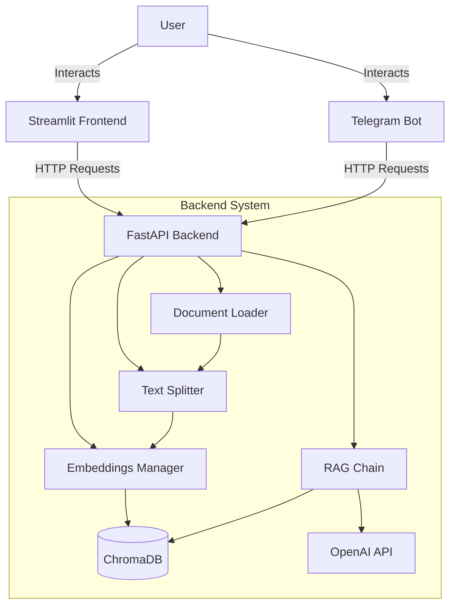

# 📄 Multi-language RAG Document Assistant - Technical Documentation

A production-ready RAG (Retrieval-Augmented Generation) assistant that allows users to query documents (PDF, XT) in multiple languages with accurate source attribution.

## Key Features

- **Multi-document Support**: specialized loaders for PDF and TXT files.
- **Intelligent Chunking**: Overlapping chunks to preserve context (500 chars with 50 chars overlap).
- **Multilingual Support**: Explicit prompts for English, Russian, Kazakh, French, German, Spanish, Chinese, and Japanese.
- **RAG Architecture**: Uses ChromaDB for vector storage and OpenAI for embeddings/generation.
- **Source Attribution**: Answers include citations and previews of the source text.
- **Modern UI**: Built with Streamlit, responsive for desktop and mobile.
- **API**: FastAPI backend for decoupled architecture.
- **Telegram Bot**: Full-featured bot integration for mobile access.
- **User Isolation**: Support for `user_id` to separate indexed documents between users.

## System Architecture

The project follows a decoupled client-server architecture:



### Components

1.  **Frontend (`frontend/`)**: 
    -   Built with Streamlit.
    -   Handles file uploads and chat interface.
    -   Communicates with backend via REST API.

2.  **Telegram Bot (`telegram/`)**:
    -   Built with `python-telegram-bot`.
    -   Supports document uploads (PDF/TXT) and text queries.
    -   Maintains user state for language preference.

3.  **Backend (`app/`)**:
    -   **API (`main.py`)**: Exposes `/upload`, `/query`, and `/clear` endpoints.
    -   **Document Loader (`rag/document_loader.py`)**: Parses files and extracts metadata.
    -   **Text Splitter (`rag/text_splitter.py`)**: Recursively splits text into semantic chunks.
    -   **Embeddings Manager (`rag/embeddings.py`)**: Handles OpenAI embeddings and ChromaDB persistence.
    -   **RAG Chain (`rag/chain.py`)**: Orchestrates the retrieval and generation process with language-specific rules.

## Installation & Setup

### Prerequisites

- Python 3.9+
- OpenAI API Key
- Telegram Bot Token (optional)

### Steps (Manual)

1.  **Clone the repository**
    ```bash
    git clone <repository-url>
    cd Multi-language-RAG-Document-Assistant
    ```

2.  **Create and activate virtual environment**
    ```bash
    python -m venv venv
    source venv/bin/activate  # On Windows: venv\Scripts\activate
    ```

3.  **Install dependencies**
    ```bash
    pip install -r requirements.txt
    ```

4.  **Configure Environment**
    Create a `.env` file in the root directory:
    ```env
    OPENAI_API_KEY=sk-...
    TELEGRAM_BOT_TOKEN=...
    MODEL_NAME=gpt-4o-mini
    TEMPERATURE=0
    ```

## Docker Deployment (Recommended)

The easiest way to run the entire project is using Docker Compose.

1.  **Build and Start**:
    ```bash
    docker-compose up --build
    ```

This will start:
- **Backend API**: `http://localhost:8000`
- **Streamlit Frontend**: `http://localhost:8501`
- **Telegram Bot**: Automatically connects to Telegram.

## Usage

### 1. Backend API
The API is the core of the system. You can interact with it via `http://localhost:8000/docs`.

### 2. Streamlit Web Interface
Open your browser at `http://localhost:8501`. Use the sidebar for uploads and chat for queries.

### 3. Telegram Bot
1. Search for your bot on Telegram and send `/start`.
2. Select your preferred response language.
3. Upload a document (PDF/TXT).
4. Ask any question.

## API Reference

### `POST /upload`
Uploads and indexes a document.
-   **Body**: `multipart/form-data` with `file`.
-   **Query Parameters**: `user_id` (optional).
-   **Response**: `{"message": "Document processed successfully", "chunks": 15}`

### `POST /query`
Asks a question against the indexed documents.
-   **Body**: JSON `{"question": "...", "language": "...", "user_id": "..."}`
-   **Response**: Contains the `answer` and a list of `sources` with `id`, `source` (filename), and `preview`.

### `POST /clear`
Deletes documents from the vector store.
-   **Query Parameters**: `user_id` (optional).
-   **Response**: `{"message": "Documents cleared successfully"}`

## User Isolation

To ensure users don't see each other's documents, the system uses a `user_id` attribute in metadata. 
- When uploading, `user_id` is stored with each chunk.
- When querying, the retriever filters results by the provided `user_id`.
- The Streamlit app uses a default `user_id` of `streamlit_user`.

## Configuration

| Variable | Description | Default |
| :--- | :--- | :--- |
| `OPENAI_API_KEY` | Required. Your OpenAI API key. | - |
| `TELEGRAM_BOT_TOKEN` | Required for Telegram bot. | - |
| `MODEL_NAME` | LLM model to use. | `gpt-4o-mini` |
| `TEMPERATURE` | Creativity of the model (0.0 - 1.0). | `0` |
| `BACKEND_URL` | URL of the backend for frontend/bot. | `http://backend:8000` |

## 📁 Directory Structure

```
├── app/
│   ├── main.py              # API Entry point
│   ├── models/              # Pydantic models (QueryRequest, QueryResponse)
│   ├── rag/                 # RAG Core logic
│   │   ├── document_loader.py # File parsing (PDF/TXT)
│   │   ├── text_splitter.py   # Recursive chunking
│   │   ├── embeddings.py      # Vector DB management (ChromaDB)
│   │   └── chain.py           # Retrieval-QA Chain & Prompts
│   └── docs/
│       └── assets/          # Documentation assets (GIFs, images)
├── frontend/
│   └── streamlit_app.py     # Streamlit UI implementation
├── telegram/
│   └── bot.py               # Telegram bot implementation
├── data/
│   ├── uploads/             # Raw file storage
│   └── chroma_db/           # Persistent vector database
├── docker-compose.yml       # Docker orchestration
├── Dockerfile               # General docker build file
└── requirements.txt         # Project dependencies
```
