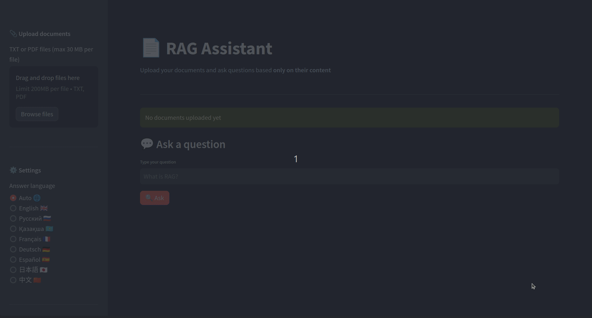
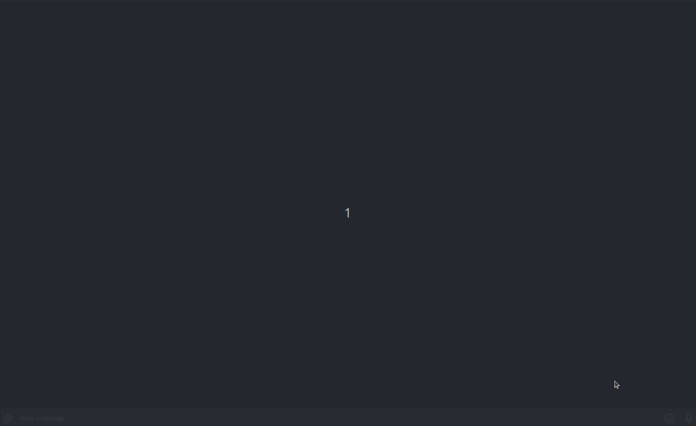

# 🤖 Multi-language RAG Document Assistant

A multi-language **Retrieval-Augmented Generation (RAG)** assistant for querying your own
documents with source attribution. FastAPI backend, Streamlit web UI, Telegram bot,
ChromaDB vector store, OpenAI embeddings and chat.

## Key Features

- **Multi-document Support**: PDF, DOCX, Markdown and plain text uploads. DOCX
  tables are read too, since that is where rates and dates usually sit. Legacy
  text encodings (cp1251, koi8-r, ...) are detected automatically.
- **Multilingual Intelligence**: Questions and answers in English, Russian, Kazakh,
  French, German, Spanish, Chinese, and Japanese - or `Auto` to mirror the question's
  language.
- **Semantic Search**: ChromaDB for fast retrieval, with per-owner metadata filtering.
- **Source Attribution**: Every answer is accompanied by a separate list of source
  filenames with 200-character previews. Inline citation markers (`[1]`, `[2]`) are
  deliberately stripped from the answer text.
- **Streamed Answers**: The web UI shows the answer as it is written, rather
  than after the whole thing is generated.
- **Conversations**: Follow-up questions work - the assistant rewrites them
  into standalone questions before searching, so "and the second one?" finds
  the right passage. The Streamlit UI keeps the transcript on screen.
- **Content Deduplication**: Re-uploading the same bytes is a no-op, per owner.
- **Document Management**: List what is indexed and delete one document at a
  time. Re-uploading a file under the same name replaces the earlier revision
  rather than letting both answer questions.
- **Multiple Interfaces**:
  - **FastAPI Backend**: REST API guarded by a shared-secret header.
  - **Streamlit Web UI**: Responsive desktop/mobile interface.
  - **Telegram Bot**: Query your documents on the go.
- **Dockerized**: Separate development and production Compose configurations.

## Architecture Overview

- **Frontend**: Streamlit application for web-based interaction.
- **Bot**: Telegram bot built on `python-telegram-bot`.
- **Backend**: FastAPI server orchestrating the RAG pipeline.
- **RAG Core**: Document loading, chunking, and retrieval built on LangChain
  (`langchain`, `langchain-community`, `langchain-chroma`) with a custom OpenAI
  embedding function.
- **Storage**: ChromaDB for vector embeddings, local filesystem for raw uploads.

## Quick Start

1. **Clone & configure**:
   ```bash
   git clone <repo-url>
   cd Multi-language-RAG-Document-Assistant
   cp .env.template .env
   ```
   Then edit `.env`:
   - `OPENAI_API_KEY` - required, the app refuses to start without it.
   - `BACKEND_API_KEY` - the shared secret every client sends as `X-API-Key`.
     Replace the placeholder with a long random ASCII string. Leaving it **empty**
     disables authentication entirely (development only; a warning is logged).
   - `TELEGRAM_BOT_TOKEN` - required only if you run the bot service.

2. **Run with Docker**:
   ```bash
   # Development: bind-mounts your working tree and runs the API with --reload
   docker compose up --build

   # Production: code baked into the image, no reload, detached
   docker compose -f docker-compose.yml up -d --build
   ```
   `docker compose up` auto-merges `docker-compose.override.yml`, so the plain command is
   always the *development* configuration. Pass `-f docker-compose.yml` explicitly to run
   the production shape.

   Without a valid `TELEGRAM_BOT_TOKEN` the `bot` container exits and restarts in a loop.
   Start just the web stack instead: `docker compose up backend frontend`.

3. **Access the services**:
   - **Frontend**: `http://localhost:8501`
   - **API Docs**: `http://localhost:8000/docs` - published on the **loopback interface
     only**; the frontend and bot reach the API over the internal `rag_net` network.

4. **Telegram Bot**:
   - Send `/start` and pick an answer language.
   - Attach a PDF, DOCX, Markdown or TXT file to index it.
   - Send any plain text message to ask a question about your documents.
   - `/documents` lists what is indexed, `/clear` deletes all of it,
     `/help` shows usage.

## Run without Docker

```bash
python -m venv .venv && source .venv/bin/activate   # Windows: .venv\Scripts\activate
pip install -r requirements.txt

uvicorn app.main:app --reload --port 8000      # backend
streamlit run frontend/streamlit_app.py        # web UI
python -m clients.telegram_bot                 # bot
```

All three read the same `.env` from the repository root.

## Development

```bash
pip install -r requirements-dev.txt
ruff check app frontend clients evaluation tests
pytest -q
```

Dependencies are declared in `requirements*.txt` and resolved into
`requirements*.lock` (every transitive package pinned and hashed), which is what
the Docker image and CI install. The locks target linux / CPython 3.10, so
install from `requirements.txt` on a Windows or macOS machine. See
[DOCUMENTATION.md](DOCUMENTATION.md) for how to regenerate them.

The test suite runs **fully offline** - embeddings are replaced with deterministic local
vectors and the OpenAI chat client is injected, so no test makes a network call.
`OPENAI_API_KEY` still has to be set to any non-empty value.


**Demonstration of work**:






For detailed installation, API reference, and configuration, see
[DOCUMENTATION.md](DOCUMENTATION.md).
